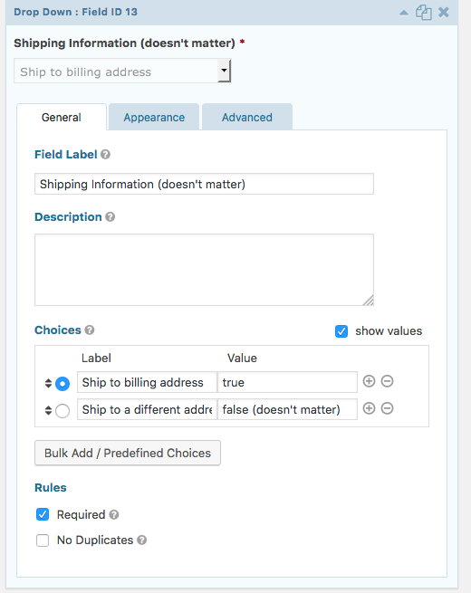

# gf-sagepay

Gravity forms add-on for SagePay.

<!-- START doctoc generated TOC please keep comment here to allow auto update -->
<!-- DON'T EDIT THIS SECTION, INSTEAD RE-RUN doctoc TO UPDATE -->


- [Minimum Requirements](#minimum-requirements)
- [Installation](#installation)
  - [Via Composer (Recommended)](#via-composer-recommended)
  - [Build from Source](#build-from-source)
- [Features](#features)
- [Not Supported / Not Implemented](#not-supported--not-implemented)
- [Best Practices](#best-practices)
  - [HTTPS Everywhere](#https-everywhere)
  - [Payment Status](#payment-status)
  - [Fraud Protection](#fraud-protection)
- [Test Sandbox](#test-sandbox)
- [FAQ](#faq)
  - [Missing Gift Aid Acceptance Box](#missing-gift-aid-acceptance-box)
  - [GF SagePay is Missing on Form Settings](#gf-sagepay-is-missing-on-form-settings)
- [Public API](#public-api)
  - [Build URL for continuing confirmation](#build-url-for-continuing-confirmation)
  - [Redirect URL Retrieval Failure Handling](#redirect-url-retrieval-failure-handling)
- [Coding](#coding)
  - [Required Reading List](#required-reading-list)
  - [Gravity Forms](#gravity-forms)
  - [Code Style](#code-style)

<!-- END doctoc generated TOC please keep comment here to allow auto update -->

## Minimum Requirements

- PHP v7.1
- php-curl
- WordPress v4.9.5
- Gravity Forms v2.2.6.1

## Installation

### Via Composer (Recommended)

```bash
# composer.json
{
  "repositories": [
    {
      "type": "vcs",
      "url": "git@github.com:ItinerisLtd/gf-sagepay.git"
    }
  ]
}
```

```bash
$ composer require itinerisltd/gf-sagepay
```

### Build from Source

```bash
# Grab the source code
$ git clone https://github.com/ItinerisLtd/gf-sagepay.git
$ cd gf-sagepay

# Verify PHP version
# Your local PHP version must be the same as the remote server one
$ php -v

$ composer build
# ...omitted...
Creating the archive into "release".
Created: release/gf-sagepay.zip
```

Then, upload and install `gf-sagepay.zip` as a usual plugin.
The unzipped directory name must be `gf-sagepay`, for example: `wp-content/plugins/gf-sagepay`.

## Features

- [SagePay Server](https://www.sagepay.co.uk/support/15/36/sage-pay-server-understanding-the-process)
- [Gift Aid](https://www.sagepay.co.uk/support/12/36/gift-aid)
- [3D Secure](https://www.sagepay.co.uk/support/12/36/3d-secure-explained)
- [AVS/CV2](https://www.sagepay.co.uk/support/28/36/activating-adding-avs/cv2-rules)
- [Gravity Forms Logging](https://docs.gravityforms.com/logging-and-debugging/)
- [Gravity Forms Notification Events](https://docs.gravityforms.com/gravity-forms-notification-events/)
- [Gravity Forms Confirmation](https://docs.gravityforms.com/configuring-confirmations-in-gravity-forms/)
- [Gravity Forms Conditional Logic](https://docs.gravityforms.com/enable-conditional-logic/)

## Not Supported / Not Implemented

Although these features are not supported by this plugin, but you might able to do so via [MySagePay](https://live.sagepay.com/mysagepay/login.msp):
- Card reference
- Token billing
- Deferred payment
- Recurring payment
- Void
- Refund
- Abort
- Basket
- Surcharges
- Account Type M – for telephone (MOTO) transactions
- Account Type C – for repeat transactions

## Best Practices

### HTTPS Everywhere

Although SagePay accepts insecure HTTP sites, you should **always use HTTPS** to protect all communication.

### Payment Status

Always double check payment status on [MySagePay](https://live.sagepay.com/mysagepay/login.msp).

### Fraud Protection

To prevent chargebacks, enforce [3D Secure](https://www.sagepay.co.uk/support/12/36/3d-secure-explained) and [AVS/CV2](https://www.sagepay.co.uk/support/28/36/activating-adding-avs/cv2-rules) rules whenever possible.

## Test Sandbox

Always test the plugin and your fraud protection rules in test sandbox before going live.


If you can't whitelist test server IPs, use `protxross` as `Vendor Code`.


Use [ngrok](https://ngrok.com/) to make local notification URLs publicly accessible.


Use one of the [test credit cards](https://www.sagepay.co.uk/support/12/36/test-card-details-for-your-test-transactions).

## FAQ

### Missing Gift Aid Acceptance Box

Only registered charities can use [Gift Aid](https://www.sagepay.co.uk/support/12/36/gift-aid) through the Sage Pay platform.
The gift aid acceptance box only appears if your vendor account is Gift Aid enabled.

### GF SagePay is Missing on Form Settings

Gravity Forms capabilities behave differently on multi-user sites and its documents are incomplete.
If GF SagePay is missing on form settings, grant yourself `gf_sagepay` and `gf_sagepay_uninstall` capabilities.
See: [https://docs.gravityforms.com/role-management-guide/](https://docs.gravityforms.com/role-management-guide/)   

## Shipping Address

OmniPay requires a shipping address. 

### Use case: Not delivering any physical goods

Map the shipping address fields to the billing ones. Leave **Ship to Billing Address** unset.

### Use case: Allow ship to billing address

This is similar to the the WooCommerce way.

1. Create a `raido button` or `dropdown` field
1. Set the **Ship to billing address** value to be `true`(lowercase)
    
1. Map this field as **Ship to Billing Address**
1. Hide/show shipping address field by [conditional logic](https://docs.gravityforms.com/enable-conditional-logic/) accordingly 

Limitation:

- Only one active `gf-sagepay` feed per form
- `Checkboxes` are not supported

## Public API

### Build URL for continuing confirmation

`ConfirmationHandler::buildUrlFor(Entry $entry, int $ttlInSeconds = 3600): string`

Usage:
```php
<?php
$entryId = 123;
$rawEntry = GFAPI::get_entry($entryId);
if (is_wp_error($rawEntry)) {
    wp_die('Entry not found');
}

$url = ConfirmationHandler::buildUrlFor(
    new Entry($rawEntry),
    86400 // expires in 24 hours (24*3600=86400)
);

echo $url;
// https://example.com?entry=123&gf-sagepay-token=XXXXXXXXXXXX
```

Use Case:
With ["using confirmation query strings to populate a form based on another submission"](https://docs.gravityforms.com/using-confirmation-query-strings-to-populate-a-form-based-on-another-submission/):
1. User fills in formA
1. User completes SagePay checkout form
1. User comes back and hits `CallbackHandler`
1. `CallbackHandler` sends user to formB according to confirmation settings
1. User arrives formB url with merged query strings

If the user quits before completing formB, you could use `ConfirmationHandler::buildUrlFor` generate a single-use, short-lived url for the user to resume formB.

Note:
- The url continues Gravity Forms confirmation
- Whoever got the url will go on confirmation, no authentication performed
- The confirmation will use latest field values from database which could have changed
- No payment status checking

### Redirect URL Retrieval Failure Handling

After form submit, this plugin sends order information to SagePay in exchange for a redirect URL(the SagePay hosted checkout form URL).

By default, when redirect URL retrieval fails:
1. Mark entry payment status as `Failed`
1. [Log](https://docs.gravityforms.com/logging-and-debugging/) the error     
1. `wp_die` **immediately**

Common failure reasons:
- Incorrect vendor code
- Server IP not whitelisted

Tips: Check the [log](https://docs.gravityforms.com/logging-and-debugging/).


You can use `'gf_sagepay_redirect_url_failure_wp_die'` filter to:
- continue Gravity Forms' feed and confirmation flow
- perform extra operations
- redirect to a different error page

**Important:** If this filter returns `false`, normal Gravity Forms' feed and confirmation flow continues.
Improper settings might lead to disasters. 

Example:
```php
add_filter('gf_sagepay_redirect_url_failure_wp_die', function(bool $shouldWpDie, ServerAuthorizeResponse $response, Entry $entry, GFPaymentAddOn $addOn): bool {
    
    // Do something.
    
    return true; // Do `wp_die` 
    return false; // Don't `wp_die`, continue normal flow
    return $shouldWpDie; // Undecisive 
}, 10, 4);
```

## Coding

### Required Reading List

Read the followings before developing:

- [SagePay Server: Understanding the process](https://www.sagepay.co.uk/support/15/36/sage-pay-server-understanding-the-process)
- [SagePay Server integration kits, protocols and documents](https://www.sagepay.co.uk/support/find-an-integration-document/server-integration-documents)
- [Gravity Forms: GFPaymentAddOn](https://docs.gravityforms.com/gfpaymentaddon/)
- [Gravity Forms: Entry Object](https://docs.gravityforms.com/entry-object/)
- [Omnipay: Sage Pay](https://github.com/thephpleague/omnipay-sagepay)
- [thephpleague/omnipay-sagepay#45 (comment)](https://github.com/thephpleague/omnipay-sagepay/pull/45#issuecomment-150667423)
- [thephpleague/omnipay-sagepay#255 (comment)](https://github.com/thephpleague/omnipay/issues/255#issuecomment-90509446)

### Gravity Forms

Gravity Forms has undocumented hidden magics, read its source code.

### Code Style

Check your code style with `$ composer check-style`. It's a mix of PSR-1, PSR-2, PSR-4 and [WordPress Coding Standards](https://github.com/WordPress-Coding-Standards/WordPress-Coding-Standards).
Change [ruleset.xml](./ruleset.xml) when necessary.
